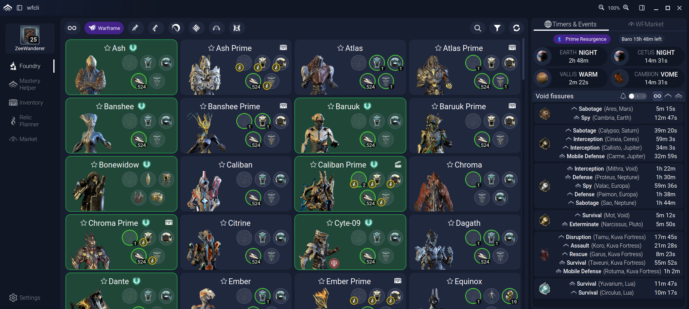
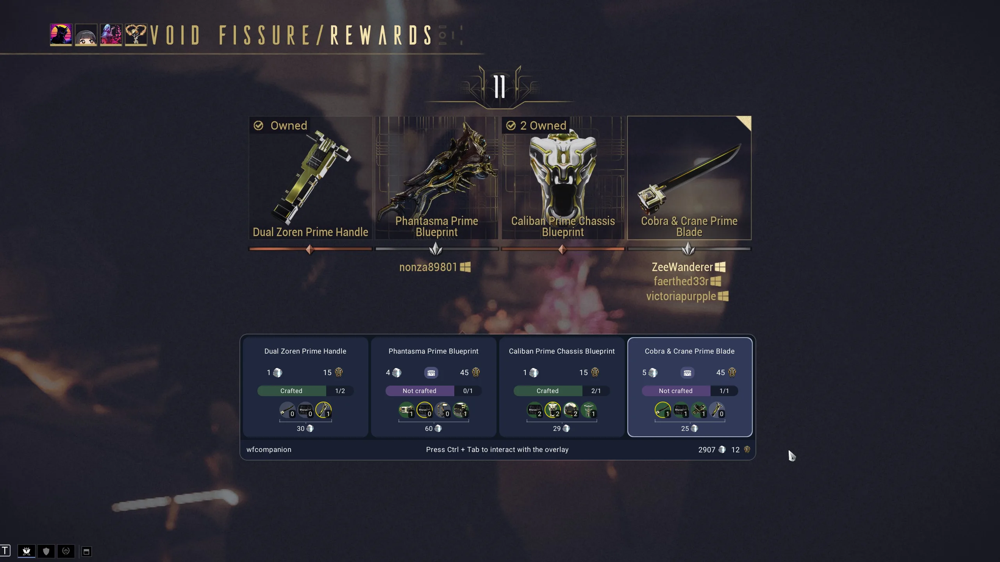
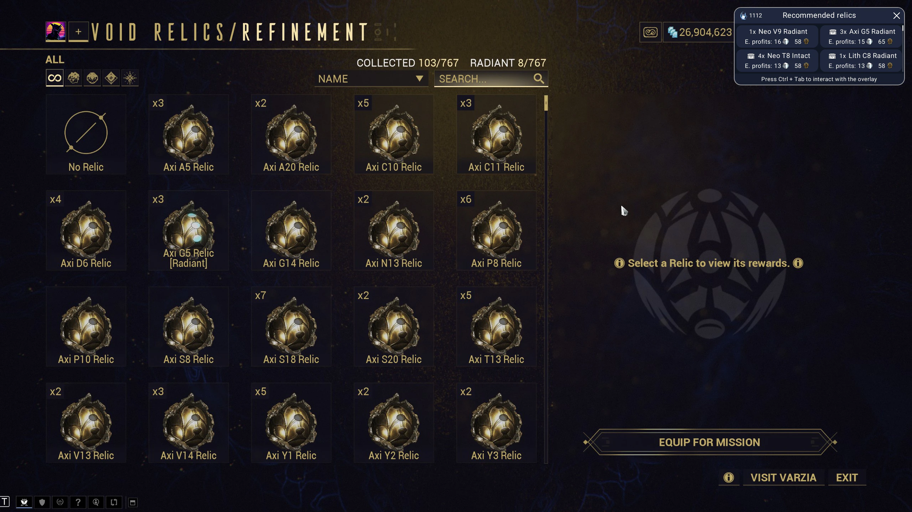

# wfcli

Warframe toolkit for terminal, desktop, MCP, and Linux/Proton in-game use. A shared Erlang/OTP
daemon owns fetching, caches, queries, watches, player data, Market access, and Forma planning.
Clients remain focused on their interface.

## Applications

| Application | Purpose |
| --- | --- |
| [`wfcli`](docs/cli.md) | Terminal client, daemon controls, and stdio MCP entrypoint |
| [`wfdaemon`](docs/daemon.md) | Supervised data, persistence, query, market, watch, and planning service |
| [`wfcompanion`](docs/companion.md) | Linux/Proton game observer and Wayland overlay |
| [`wfgui`](docs/gui.md) | Native Qt desktop client for account and world-state views |
| [`wfcore`](docs/developer/shared_utilities.md) | Process-free contracts and value helpers shared by OTP applications |

Clients start `wfdaemon` when needed. Concurrent clients reuse its caches and rate-limited work.

## Desktop GUI

`wfgui` provides Foundry, Mastery Helper, Inventory, Relic Planner, and Market views alongside
live world timers and fissures.



## In-game Overlays

`wfcompanion` augments relic rewards with Market values and collection progress, then ranks owned
relics during selection.





## Build

Required toolchains:

| Area | Requirements |
| --- | --- |
| Common | Git, GNU Make, CMake, and a C/C++ compiler |
| Erlang | Erlang/OTP 29 and Rebar3 |
| Companion | Rust, Cargo, `jq`, and MinGW-w64 |
| Desktop GUI | LLVM with libc++, Ninja, vcpkg, Autoconf, Autoconf Archive, Automake, and Libtool |

`wfcompanion` runtime integration requires KDE Plasma on Wayland, KScreen, and Tesseract 5 with
English language data. `ccache` is optional. FFmpeg with VP9 support is used for animated overlay
previews, and `zip` is used for release archives.

Initialize dependencies and build development and production trees:

```bash
git submodule update --init
export VCPKG_ROOT=/path/to/vcpkg
make build
```

Build one environment:

```bash
make dev   # debug builds in dev/
make prod  # optimized builds in prod/
```

Compiler output stays under `_build/`; downloads and compiler caches stay under `.cache/`.
Repository-root links select either staged environment:

| Development | Production |
| --- | --- |
| `wfclid` | `wfcli` |
| `wfdaemond` | `wfdaemon` |
| `wfcompaniond` | `wfcompanion` |
| `wfguid` | `wfgui` |

Common contributor commands and individual build targets are documented in
[Development workflows](docs/developer/workflows.md).

## Run

Use the production CLI and GUI after `make prod`:

```bash
./wfcli fissures
./wfcli baro inventory
./wfcli query 'dataset=worldstate type=fissure hard=true'
./wfgui
```

The CLI starts or reuses `wfdaemon`. Built-in help covers the complete command surface:

```bash
wfcli --help
wfcli help commands
wfcli COMMAND --help
```

For in-game overlays and player data, set Warframe's Steam launch options to:

```bash
/absolute/path/to/wfcli/prod/bin/wfcompanion launch -- %command%
```

See the [companion guide](docs/companion.md) before enabling launch mode.

Register the MCP adapter with a host using the same production client:

```bash
codex mcp add wfcli -- /absolute/path/to/wfcli/prod/bin/wfcli mcp
```

## Documentation

| Guide | Contents |
| --- | --- |
| [Command-line client](docs/cli.md) | Command groups, help, completion, paths, and notifications |
| [Query language and watches](docs/query.md) | Datasets, expressions, raw paths, sorting, paging, and subscriptions |
| [Data sources and updates](docs/data-sources.md) | Provenance, managed caches, and refresh behavior |
| [Forma planner](docs/forma-plan.md) | Configuration, constraints, output, and visualization |
| [Daemon control](docs/daemon.md) | Lifecycle, idle policy, autostart, compatibility, and hot updates |
| [Linux/Proton companion](docs/companion.md) | Steam setup, overlay controls, diagnostics, previews, and player data |
| [Desktop GUI](docs/gui.md) | Pages, loading behavior, notifications, and screenshots |
| [MCP server](docs/mcp.md) | Registration, tools, resources, and cancellation |
| [Contributor documentation](docs/DEVELOPER.md) | Architecture, source ownership, tests, and development workflows |

## License

Project code is licensed under Apache-2.0; see [LICENSE.md](LICENSE.md). Third-party components and
Digital Extremes assets retain their own terms. Warframe assets are used under the
[Warframe Content Policy](https://www.warframe.com/en/contentpolicy); provenance notes live beside
the relevant files.
